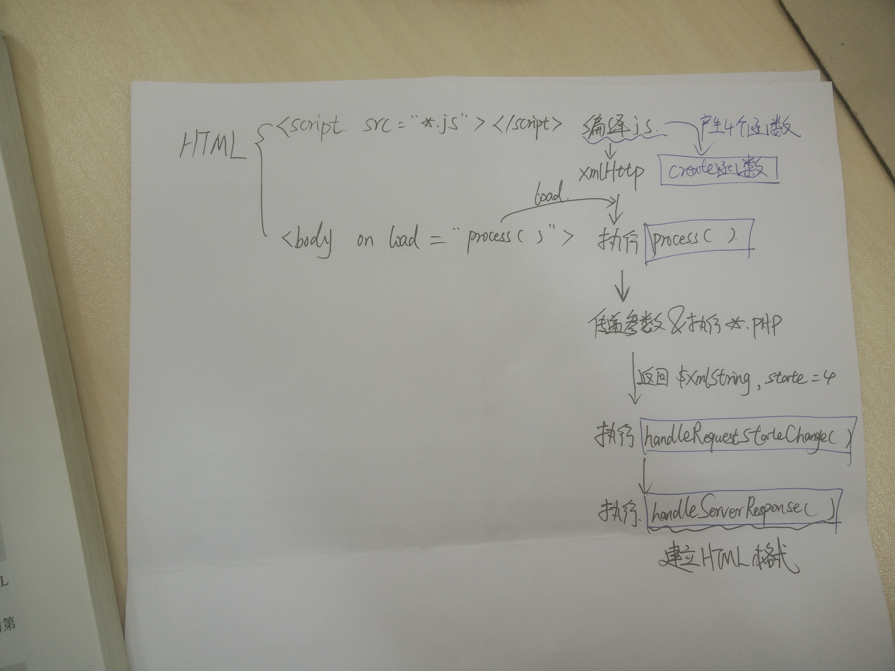

## (Ajax & [XMLHttpRequest](http://www.w3schools.com/xml/dom_http.asp)) in JS & PHP

***

简介：
	
Ajax可以建立JS和PHP之间的联系，做到异步通信，从而实现不需要重新加载页面就可以更新页面数据的功能。其中最重要的就是**XMLHttpRequest**对象的使用。

#### 0. 命名一个XMLHttpRequest对象

	var xmlHttp=createXmlHttpRequest();

#### 1. 创建一个XMLHttpRequest对象并返回 

**function *createXmlHttpRequestObject()***

	var xmlHttp;
	try{
		xmlHttp = new XMLHttpRequest();
	}
	catch(e){
		try{
			xmlHttp = new ActiveXObject("Microsoft.XMLHttp");
		}
		catch(e){}
	}
	if (!xmlHttp)
		alert("Error creating!")
	else
		return xmlHttp;

#### 2. 创建调用服务器请求 

**function *process()* (由html文件调用)**

首先建立和PHP文件的连接并传递参数，然后监听服务器响应（异步），传递参数有两种方式实现：

* GET:        

	`xmlHttp.open("GET",*.php?param1=x&&param2=y,true);
	xmlHttp.onreadyStatechange=headleRequestStateChange;`当readystate(0/1/2/3/4)改变时就执行handleRequestStateChange()	
	`xmlHttp.send(null);`
	

**true** : 异步的关键！当建立连接之后，脚本（send和onreadystatechange）继续执行，监听服务器响应。

* POST:            

	`xmlHttp.open("GET",http://../../.php,true);`
	`xmlHttp.onreadyStatechange=handleRequestStateChange;`   
	**run handleRequestStateChange when readystate change**
	`xmlHttp.send("param1=x&&param2=y");`

#### 3. 服务器返回数据(回调方法)

**function *handleRequestStateChange()***

	if (xmlHttp.readyState==4){    //readystate=4 请求建立完成
		if(xmlHttp.status==200){     //status:http状态
			try{
				response=xmlHttp.responseText;  //把PHP返回的text数据存储在response里面 
				//打印出response内容
				//如果PHP返回的时XML数据，就要调用 handleServerResponse();
			}
			catch(e){					
				alert("Error reading the response:"+e.toString());
			}
		}
		else{
			alert("Error retrieving the data:\n"+xmlHttp.statusText);
		}
	}  

#### 4. Turn XML to HTML

**functon *handleServerResponse()***

	vara xmlResponse=xmlHttp.responseXML;  \\get a XML DOM object from a xmlstring!
	xmlRoot=xmlResponse.documentElement;
	Array1=xmlRoot.getElementByTagNmae("tagname");
	\\make html\\
	Array1.item(1).firstchild.fata

#### 5. PHP

##### 5.1 Create a XML document
	$dom=new DOMDocument();
	\\root 
	$root=$dom->createElement('root');
	$dom->appendChild($root)
	......
	$xmlString=$dom->saveXML();  \\get a xmlstring
	echo $xmlString;

##### 5.2 接受来着JS的参数
	$name1=$_GET ['name1'];

## 6. Conslusion

